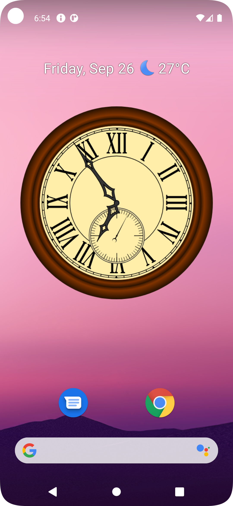
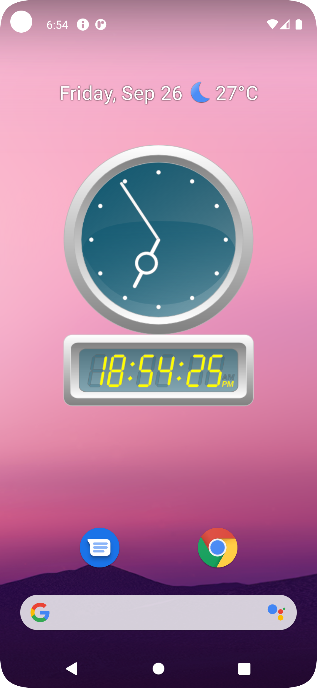

[Japanese](readme_ja.md)

# svgclock-ad

I've created a desktop utility program for Android that displays a clock using SVG files.

The original svgclock-rs is [here](https://github.com/zuntan/svgclock-rs).

# Features

- Displays the current time using SVG files created with Inkscape.
    - Compatible with SVG files used by svgclock-rs. Some features are omitted.
- Can display clocks in 7 different designs. (Ver 0.1.0)
- **Draws an “analog” clock, complete with a second hand,** either on the application screen or via a widget.
	- This is reportedly difficult to achieve. Many apps either cannot animate accurately or experience drawing updates stopping.
        - Per Android SDK specifications, widgets can only update approximately every 30 minutes.
    - This app implements sub-second drawing processing by **requiring users to enable the widget update service**.
		- We will continue researching this.

# Screenshot

- Activity
    - 
    - 
- Widget Registration
    - 
- Widget
    - 
    - 
    - 
    - 

# Installation

Please download the latest binary from the [release page](https://github.com/zuntan/svgclock-ad/releases).

---

Translated with DeepL.com (free version)