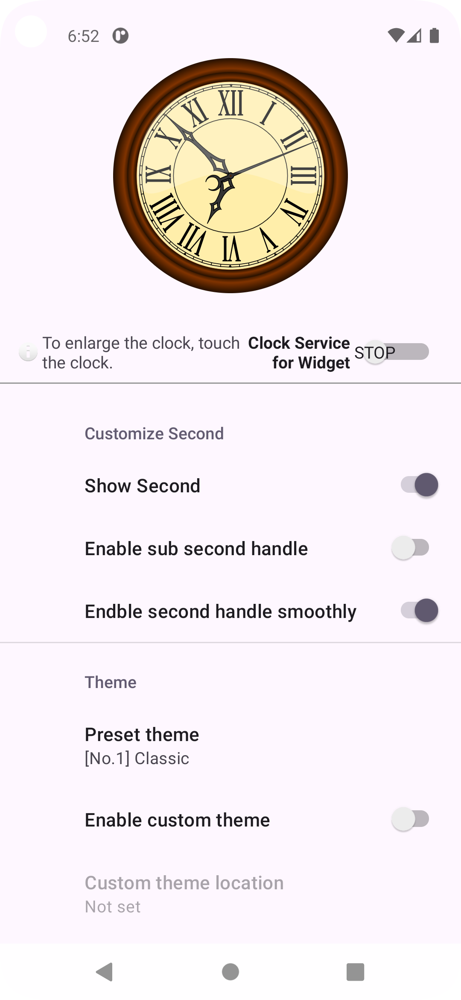
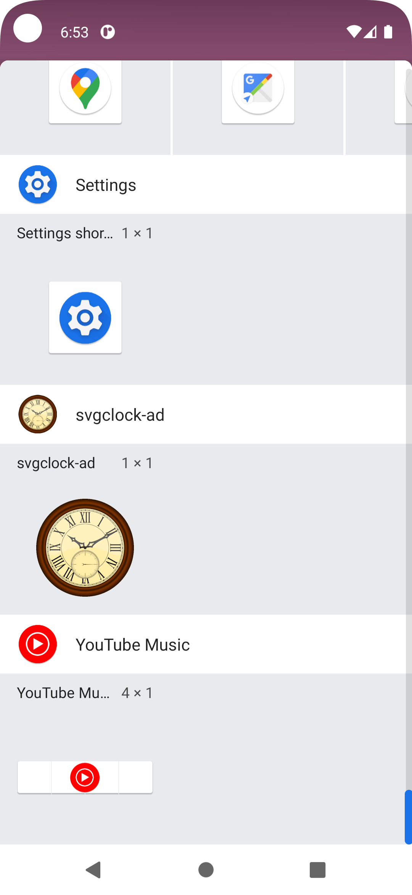
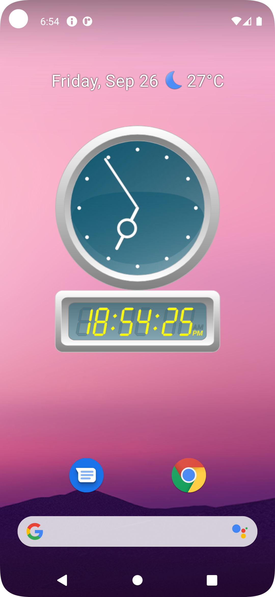
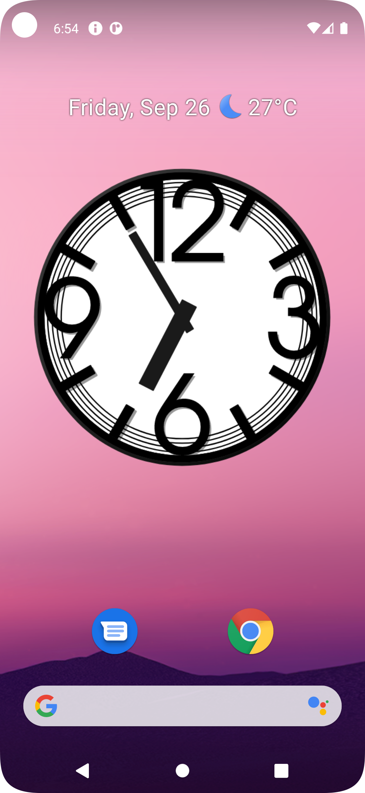
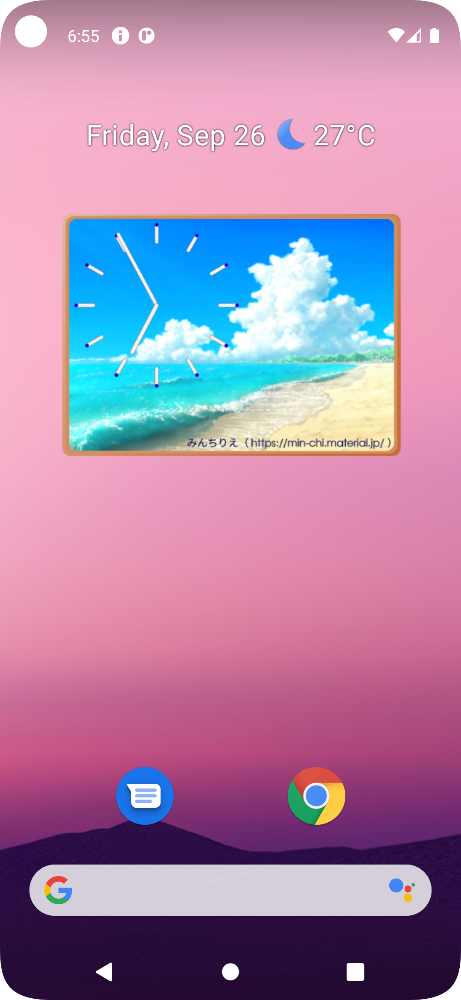

[English](readme.md)

# svgclock-ad

SVGファイルを用いて時計を表示するデスクトップユーティリティープログラムを Android 用に作ってみました。

元の svgclock-rs は[こちら](https://github.com/zuntan/svgclock-rs)です。

# 特徴

- Inkscape を用いて作成したSVGファイルを利用して、現在の時刻を表示します。
	- svgclock-rs で使用しているSVGファイルと互換です。一部機能はオミットしています。
- 7種類のデザインの時計を表示することができます。（Ver 0.1.0）
- アプリケーション画面上、または**ウィジェットで「アナログ」な時計を秒針まで含めて描画**します。
	- 普通はできないそうです。もしくは正確にアニメーションできなかったり、描画更新が止まったりするアプリが世の中には沢山あるとのことです。
		- Android SDKの仕様として、ウィジェットは30分間隔程度でしか更新できないそうです。
	- 本アプリも、**ユーザーがウィジェット更新用サービスをオンにする**ことで、秒未満での描画処理を実装しています。
		- 今後も研究します。

# スクリーンショット

- アクティビティ
- 
	- 
	- 
- ウィジェット登録
	- 
- ウィジェット
	- 
	- 
	- 
	- 

# 導入

[リリースページ](https://github.com/zuntan/svgclock-ad/releases)から最新のバイナリをダウンロードしてください。

---
